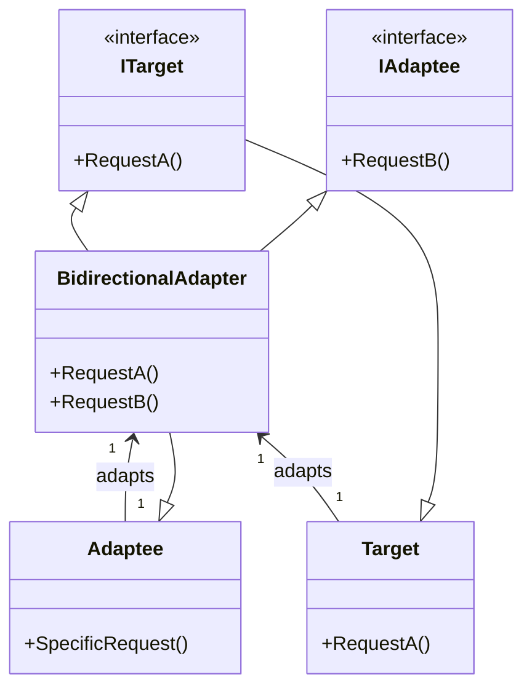

```mermaid
classDiagram
    class ITarget {
        <<interface>>
        +RequestA()
    }

    class Adaptee {
        +SpecificRequest()
    }

    class IAdaptee {
        <<interface>>
        +RequestB()
    }

    class Target {
        +RequestA()
    }

    class BidirectionalAdapter {
        +RequestA()
        +RequestB()
    }

    ITarget <|-- BidirectionalAdapter
    IAdaptee <|-- BidirectionalAdapter
    Adaptee <|-- BidirectionalAdapter
    Target <|-- ITarget
    BidirectionalAdapter "1" <-- "1" Adaptee : adapts
    BidirectionalAdapter "1" <-- "1" Target : adapts

```